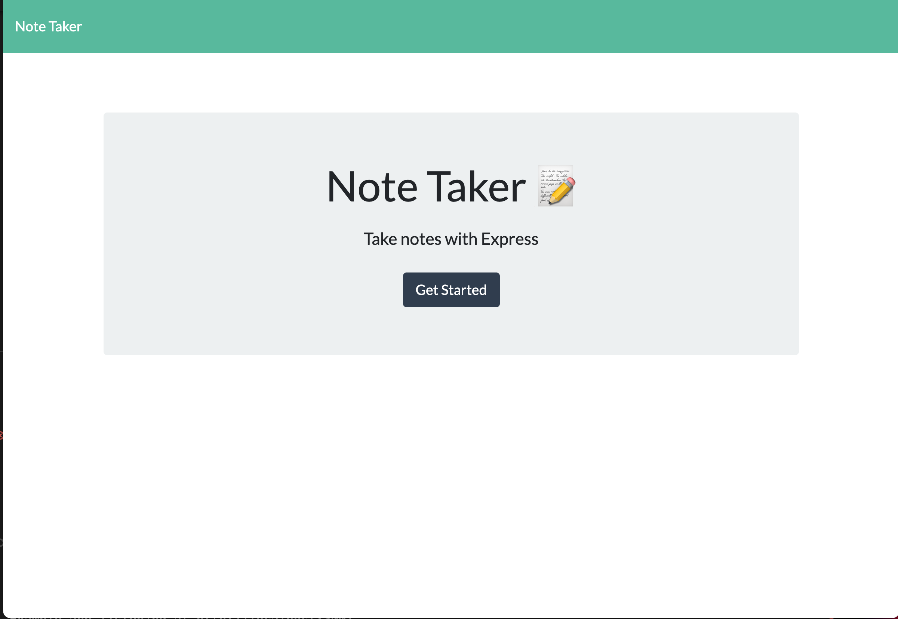
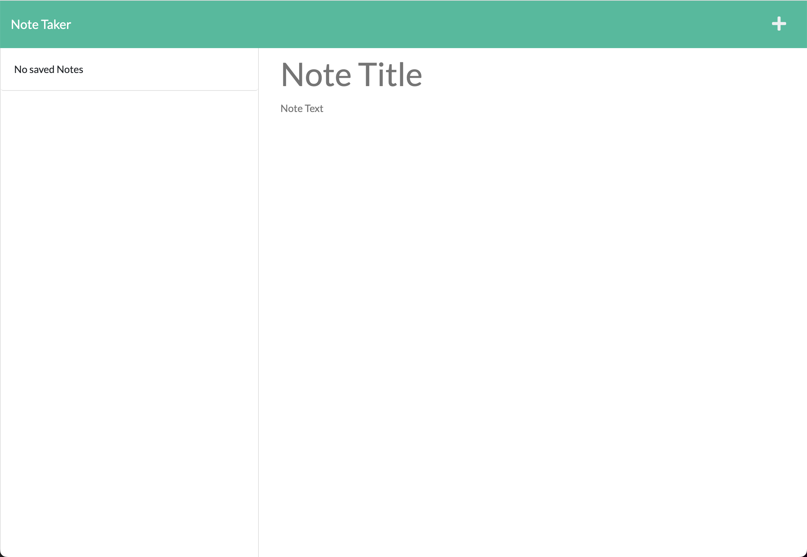
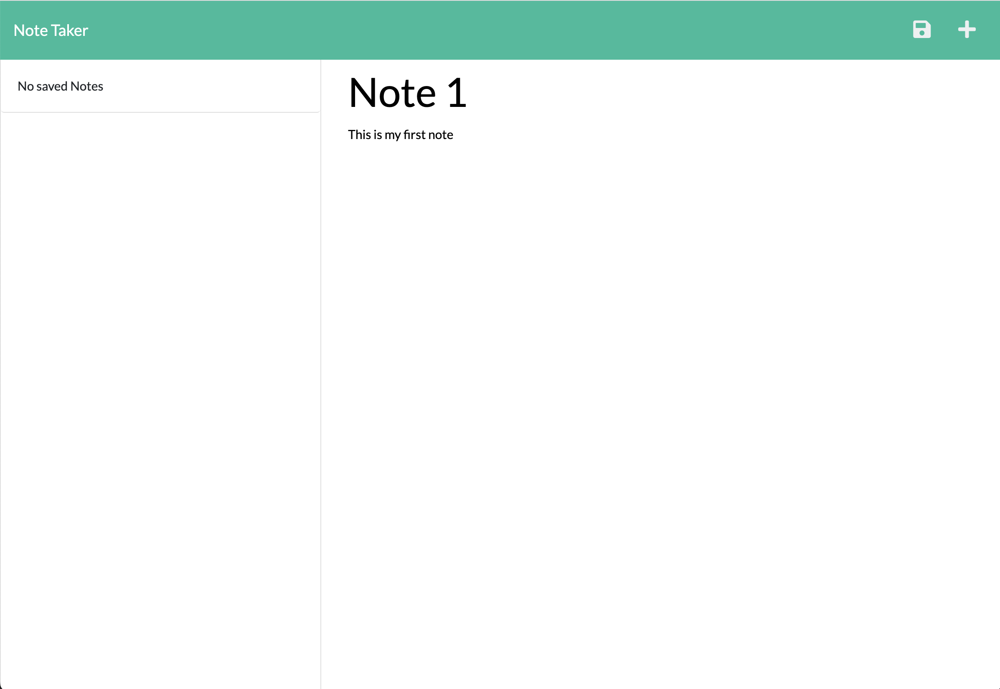
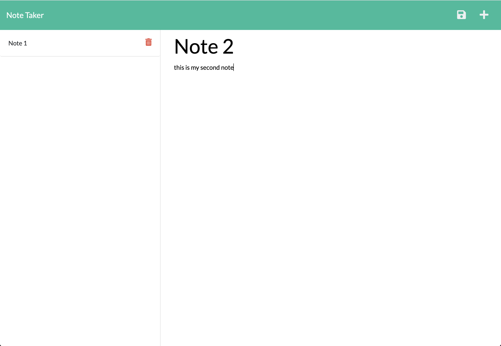
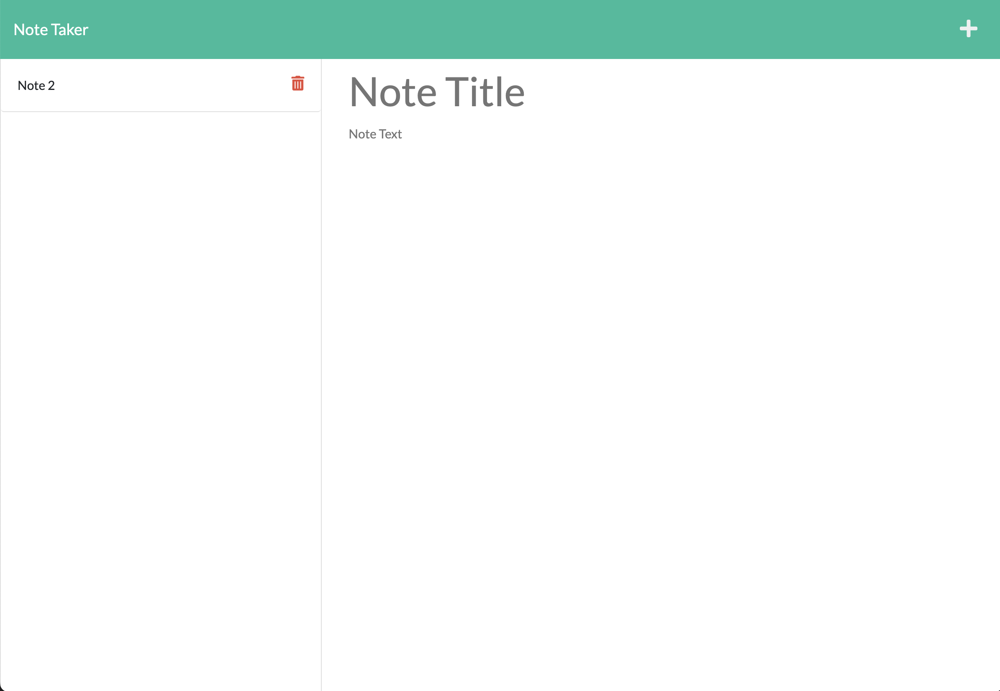

# A Breakdown of Express.js: Note Taker

## Description

This project functions as a note taking app in order to keep one's thoughts and reminders in one place. This was achieved by connecting front-end starter code to an Express.js back end in order to save and retrieve note data from a JSON file.

## Table of Contents 

- [Installation](#installation)
- [Usage](#usage)
- [Contribution](#contribution)
- [Questions](#questions)

## Installation

Steps required to install your project:

In order to use this application you can either download the repository code from my GitHub here: 
[Express.js Note Taker Github Repository](https://github.com/savannahfausto/Fausto_Express_Note_Taker)

Or you can follow the link to the deployed web page by Heroku:

## Usage

Find below instructions and examples for project use. 

Provided below are images from the application. As you can see the user is first taken to a homepage where they have the option of clicking "Get Started." 

Then the user is taken to the notes page where they can see past notes on the left column (if there are any) and the ability to create a new note by clicking the + symbol in the top right hand corner. 

If the user, chooses to create a new note, once they input a note title and a note text, a save icon will appear. Once the user is done creating their note, they can click on the save icon which will populate this new note on the left side bar with the other saved notes. 

Finally the user has the option of deleting a particular note if desired.

Here is a walkthrough video showing the functionality of this web application: 
[Link to walkthrough video](https://drive.google.com/file/d/1aA8aBxAsjQOcvvId7IAnApioTnhGsYWv/view)

## Contribution

I am currently not taking contributions from other developers right now, but please feel free to contact me with questions.

## Questions

Thank you so much for taking interest in this project. If you have any questions or feedback please reach out to me: 

My github profile is: 
[GitHub Link](https:///github.com/savannahfausto)

My email is: 
[savannahfausto@gmail.com](mailto:savannahfausto@gmail.com)
